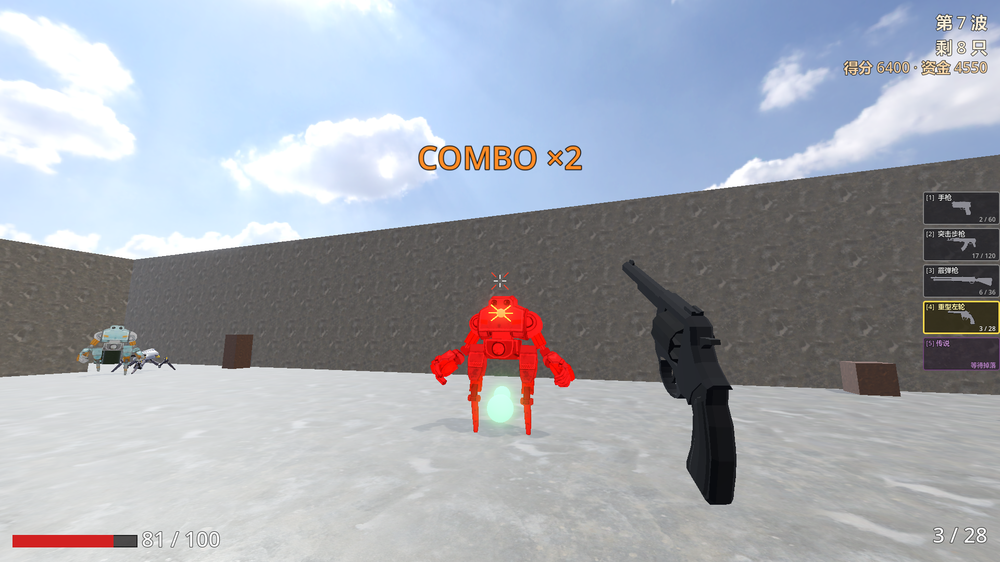

# LastStand · 阵地战

一款用 Godot 4 做的波次生存 FPS。守住阵地，杀掉来犯的敌人，每波之间抽卡升级。

[](https://mr-salticidae.itch.io/last-stand)
[](https://godotengine.org/)

---

## 截图





## 核心玩法

- **30 波生存通关**：每波杀光自动推进，活到第 30 波触发凯旋结局
- **三档难度**：新兵报到 / 日常训练 / 极限突破，10 项子参数差异化（敌人血量、移速、攻击欲望、刷新节奏等）
- **武器系统**：4 把基础（手枪 / 突击步枪 / 霰弹枪 / 左轮）+ 2 把传说（重机枪 / 电磁炮，敌人掉落解锁）
- **敌人种类**：grunt / runner / brute / elite (飞行) / boss，分波次解锁
- **局内升级**：每波清空抽 3 选 1 卡牌，普通 / 稀有 / 传说三档稀有度
- **3 张地图**：训练场 · 工业仓库 · 前哨站

## 操作

| 键位 | 功能 |
|---|---|
| WASD | 移动 |
| 鼠标 | 视角 |
| 左键 | 开火 |
| R | 装弹 |
| Shift | 冲刺 |
| Ctrl | 蹲下 / 滑铲（冲刺中按） |
| Space | 跳跃 |
| 1-5 / 滚轮 | 切武器 |
| ESC | 暂停 |

设置菜单内可重绑核心键位。

## 运行

```bash
git clone https://github.com/Mr-Salticidae/last-stand.git
```

用 Godot 4.6+ 打开 `project.godot`，F5 启动。

打包二进制：Project → Export，选目标平台（Windows / Linux / Web）。

## 技术栈

- **引擎**：Godot 4.6
- **语言**：GDScript
- **资源**：主要 CC0（Quaternius / Kenney / Mech Pack 等）

## 开发状态

当前版本 **v0.2.1** — 切后台焦点兜底 + 血包寿命机制 + 体感打磨  
完整更新日志：[GitHub Releases](https://github.com/Mr-Salticidae/last-stand/releases) · [itch.io devlog](https://mr-salticidae.itch.io/last-stand/devlog)

下一版 v0.3 计划：升级卡池扩充 / Boss 多模式 / 敌人模型替换。

## 反馈

bug 报告 / 玩法建议欢迎 Issue 或 itch.io 评论区。
