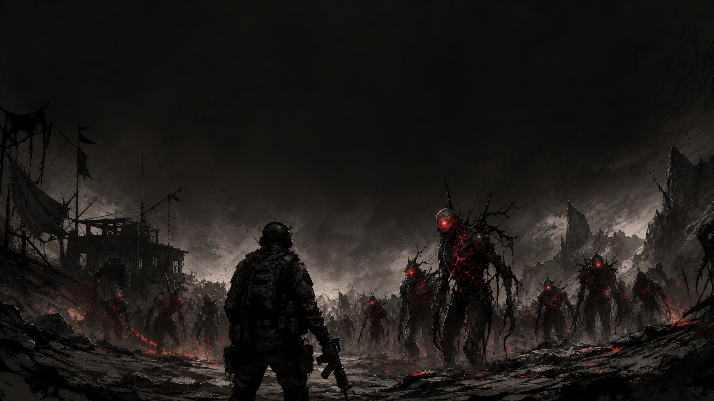

# LastStand · 死守

一款用 Godot 4 做的波次生存 FPS。守住阵地，杀掉来犯的敌人，每波之间进补给商店抽卡强化。正式版 [**v1.0.0**](https://github.com/Mr-Salticidae/last-stand/releases/tag/v1.0.0) 已发布。

[](https://mr-salticidae.itch.io/last-stand)
[](https://godotengine.org/)

---

## 核心玩法

- **两种模式**
  - **标准 · 30 波**：每波杀光自动推进，活到第 30 波触发凯旋结局
  - **无尽 · 定时波**：每波只有倒计时（20s 起、每波 +2s、封顶 60s），怪物按威胁预算持续刷新，撑到 0:00 就过波——没有终点，只有纪录
- **三档难度**：新兵报到 / 日常训练 / 极限突破，12 项子参数差异化（敌人血量、移速、攻击欲望、刷新节奏等），极限档另有专属数值曲线与高级 AI
- **武器系统**：4 把基础（手枪 / 突击步枪 / 霰弹枪 / 左轮）+ 2 把传说（重机枪 / 电磁炮，敌人掉落解锁）
- **敌人种类**：grunt / runner / brute / elite (飞行) / boss，分波次解锁
- **局内升级**：波间补给商店随机上架 3 张卡，用击杀赚到的 CR 购买（可付费刷新重抽），普通 / 稀有 / 传说三档稀有度
- **3 张地图**：训练场 · 工业仓库 · 前哨站

## 操作

| 键位 | 功能 |
|---|---|
| WASD | 移动 |
| 鼠标 | 视角 |
| 左键 | 开火 |
| R | 装弹 |
| Shift | 冲刺 |
| Ctrl | 蹲下 / 滑铲（冲刺中按） |
| Space | 跳跃 |
| 1-5 / 滚轮 | 切武器 |
| ESC | 暂停 |

设置菜单内可重绑核心键位。

## 运行

```bash
git clone https://github.com/Mr-Salticidae/last-stand.git
```

用 Godot 4.7+ 打开 `project.godot`，F5 启动。

打包二进制：Project → Export，选目标平台（Windows / Linux / Web）。

## 技术栈

- **引擎**：Godot 4.7
- **语言**：GDScript
- **资源**：武器 CC0/CC-BY（Quaternius / r2detta）；敌人精灵、BGM、音效为自制 AI 生成（Midjourney / GPT Image 2 / Suno / ElevenLabs，均订阅版商用授权）

## 开发状态

当前版本 **v1.0.0**（正式版）— 玩法特性与 v0.8.1 一致：标准 30 波 + 无尽双模式、三档难度、3 张地图、4+2 武器、波间补给商店  
完整更新日志：[GitHub Releases](https://github.com/Mr-Salticidae/last-stand/releases) · [itch.io devlog](https://mr-salticidae.itch.io/last-stand/devlog)

后续计划：按玩家反馈调优无尽模式的预算 / 时长 / 并发曲线 + 武器 2D 持枪视图 + HUD 重绘。

## 反馈

bug 报告 / 玩法建议欢迎 Issue 或 itch.io 评论区。
