# LastStand — 从 0 到发布制作教程

## 一、成品展示


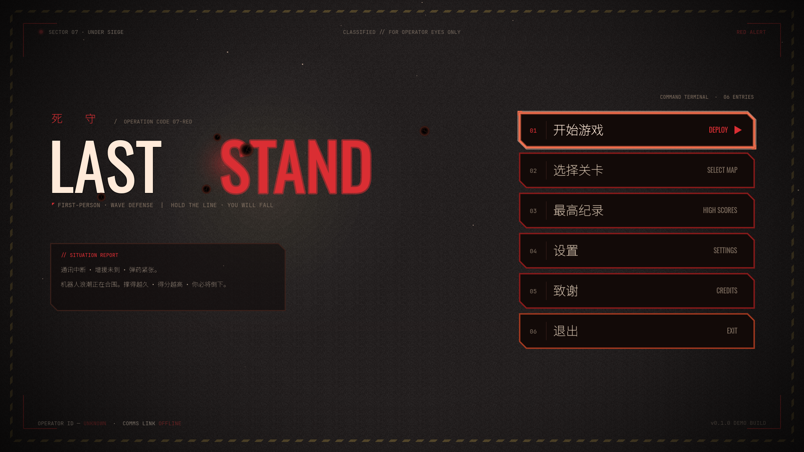

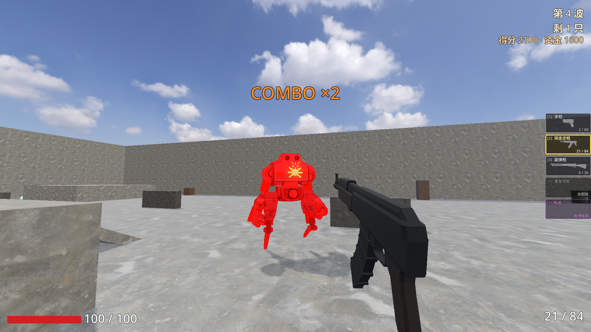

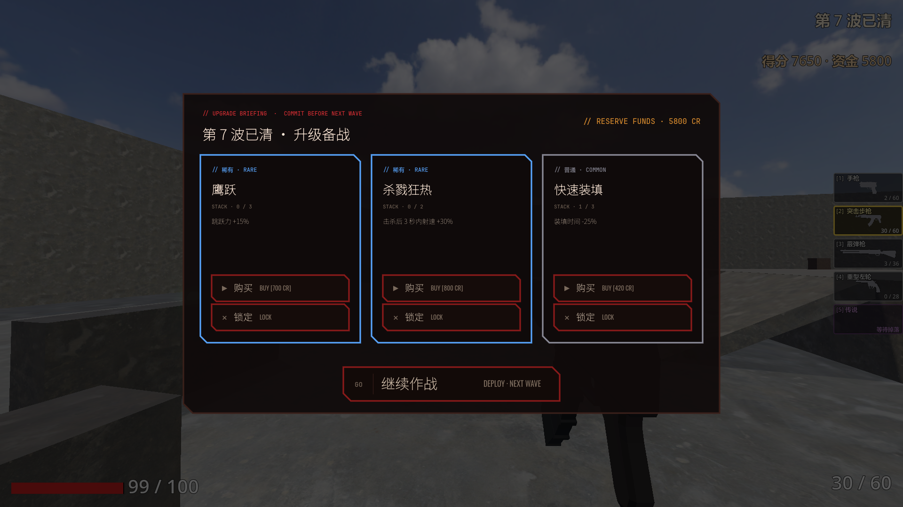

一款用 Godot 4 做的波次生存 FPS：守住阵地，杀光每一波，波间抽卡升级，活到第 30 波通关。

本教程展示这个项目从空工程到 GitHub Release + itch.io 上架的完整流程。

**项目实际规模**（截至 v0.7.0）：

| 项 | 数值 |
|---|---|
| 首次提交 | 2026-05-05 |
| 提交数 | 87 |
| GDScript 行数 | 10048 行 / 55 个脚本 |
| 最大单文件 | `enemy.gd` 1478 行 |
| 内容量 | 30 波 · 6 把武器 · 5 种敌人 · 3 张地图 · 3 档难度 |
| 资产体积 | 117 MB |
| 发布版本 | v0.1 → v0.7.0，共 7 个对外版本 |

---

## 二、所用工具

### 1. Godot 4.7 —— 引擎

开源免费，GDScript 语法接近 Python，3D FPS 的 `CharacterBody3D` + `NavigationAgent3D` 开箱即用，导出 Windows / Linux / Web 不要额外授权。个人项目不抽成。

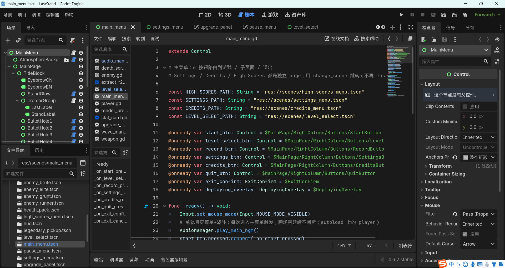

左侧场景树、中间脚本编辑器、右侧检查器、左下文件系统 —— 这四块是日常 90% 的操作区域。

官网地址： https://godotengine.org

适用场景： 中小体量 3D / 2D 游戏，尤其是一个人做、需要快速改数值试手感的项目

### 2. Claude Code —— 代码结对

在终端 / VSCode 里直接读写工程文件、跑 git。本项目的大部分 GDScript 是这样写出来的：描述要什么手感 → 生成实现 → 自己进游戏试 → 反馈调整。

官网地址： https://claude.com/claude-code

适用场景： 写系统骨架、批量重构、修 bug；**不适合**替你判断手感——手感必须自己上手玩

### 3. Midjourney + GPT Image 2 —— 敌人精灵与 key art

敌人全部是 2D 单面精灵（DOOM 式），不是 3D 模型。出图便宜、迭代快，一只怪从概念到进游戏可以压到 10 分钟。

官网地址： https://midjourney.com · https://chat.openai.com

适用场景： 敌人立绘、逐帧动画帧、封面图、商店头图

### 4. Suno —— BGM

一首循环 BGM 就够撑满整个游戏。订阅版有商用授权。

官网地址： https://suno.com

适用场景： 氛围 BGM、菜单音乐

### 5. ElevenLabs —— 音效

本项目 17 个游戏内音效（枪声、命中、击杀、敌人前摇、UI 点击、死亡）全部由它生成。

官网地址： https://elevenlabs.io

适用场景： 枪械 / UI / 怪物音效

### 6. Quaternius · r2detta —— 免费 3D 武器模型

武器用现成 CC0 / CC-BY 模型，不自己建模。**注意授权差异**：Quaternius 是 CC0 无需署名，r2detta 是 CC-BY **必须署名**。

官网地址： https://quaternius.itch.io · https://sketchfab.com/r2detta

适用场景： 武器、道具等"玩家会盯着看但不需要独特性"的模型

### 7. GitHub Releases + itch.io —— 发布渠道

GitHub 放源码和构建产物，itch.io 面向玩家、带评论区和 devlog。两边同步发。

官网地址： https://github.com · https://itch.io

适用场景： 独立游戏 demo 分发与收集反馈

---

## 三、操作方法

### 1. 立骨架：先定全局单例，再写玩法

Godot 的 autoload（全局单例）一旦定错，后面处处要绕。**开工第一件事就是把跨场景的状态想清楚**，本项目最终定了四个：

```ini
[autoload]
Settings        = 玩家设置 + 难度档位数据（存盘）
AudioManager    = BGM / SFX 统一播放
UpgradeManager  = 升级卡池与已选卡的效果
SynergyManager  = 羁绊（卡牌组合触发的额外效果）
```

在编辑器里的位置：**项目 → 项目设置 → 全局（Autoload）**。

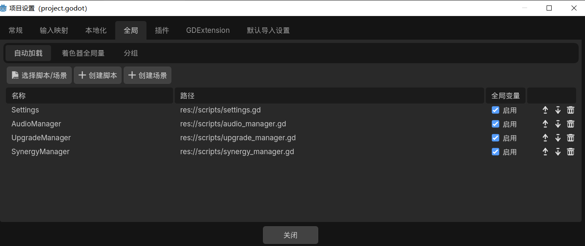

判断标准很简单：**这个东西需要跨场景活着吗？** 需要 → autoload；不需要 → 挂在场景里。玩家、敌人、武器都不是 autoload。

目录结构照抄即可：

```text
scenes/     场景（.tscn）——菜单、地图、敌人、武器各一份
scripts/    脚本（.gd）——与 scenes 平行，同名对应
assets/     资产——audio / sprites / weapons / textures / fonts 分目录
docs/       文档——含 release_notes/ 存档每版发布文案
tools/      工具脚本——一次性的资产处理、模型检查
```

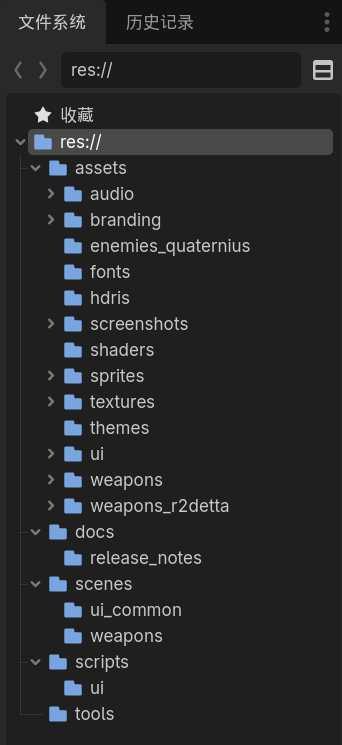

### 2. 做核心循环：一个信号驱动的波次管理器

FPS 生存游戏的骨架就是"刷怪 → 打光 → 升级 → 再刷"。把它做成一个**只发信号、不直接操作 UI** 的管理器，后面接什么 UI 都不用改它。

见 [`scripts/wave_manager.gd`](../scripts/wave_manager.gd)，它对外只发这些信号：

```gdscript
signal wave_started(wave_number, enemy_count)      # 本波开始
signal wave_progress(remaining)                    # 存活数变化
signal wave_completed(wave_number)                 # 本波清空
signal intermission_started(wave_number, seconds)  # 进入波间休整
signal currency_changed(amount)                    # 资金变化
signal combo_changed(count, broken)                # 连击变化
signal game_completed(wave)                        # 通关
```

HUD、升级面板、结算页各自去连自己关心的信号。**波次管理器不知道 UI 存在**，这样加一个新 UI 元素不需要动核心逻辑。

难度曲线全部走 `@export`，在编辑器里就能调，不用改代码重启：

```gdscript
@export var base_enemy_count: int = 4              # 第 1 波敌人数
@export var enemy_count_per_wave: int = 1          # 每波递增
@export var max_enemies_per_wave: int = 20         # 上限
@export var health_boost_every_n_waves: int = 5    # 每 5 波强化血量
@export var victory_wave: int = 30                 # 第 30 波通关
```

`@export_group` 会在检查器里自动折叠成分组，改数值不用碰代码：

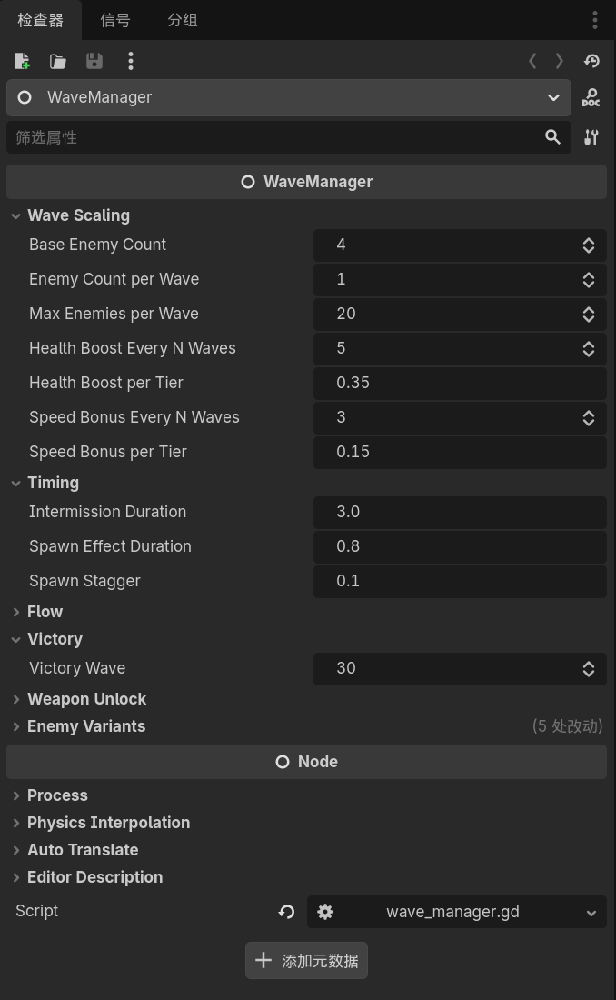

### 3. 填内容：用"解锁时间表"制造节奏

不要一上来把所有东西都给玩家。本项目用两张表把 30 波切出节奏感：

```gdscript
# 武器解锁：第 N 波打完给一把新枪
weapon_unlock_schedule = { 2: "rifle", 4: "shotgun", 6: "revolver" }

# 敌人解锁：第 N 波开始出现该类型
runner_unlock_wave = 3      # 快而脆
brute_unlock_wave  = 5      # 慢而肉
elite_wave_period  = 5      # 每 5 波固定 1 只精英
boss_wave_period   = 15     # 每 15 波固定 1 只 Boss
```

效果是玩家每两三波就拿到一个新东西，注意力有地方去。**这两张表是后期调节奏最高效的旋钮**，比改数值见效快得多。

### 4. 美术工业化：3D 敌人换成 2D 单面精灵

这是本项目最关键的一次取舍。原本敌人是 3D 模型，做动画成本高、改一版要重导，v0.5 整体换成 **DOOM 式单面精灵**：一张始终面向玩家的 2D 图片。

换完之后一只新怪的成本从"建模 + 绑骨 + K 帧"降到"出一张图 + 丢进文件夹"。

丢图即生效的目录约定（详见 [`docs/enemy_sprite_animation.md`](enemy_sprite_animation.md)）：

```text
assets/sprites/enemies/
  grunt.png              ← 单图（静止/默认帧）
  grunt/                 ← 同名文件夹（不带 .png）
    walk_0.png  walk_1.png     ← 走路循环，≥2 帧
    attack_0.png               ← 攻击前摇
    death_0.png                ← 倒地
```

加载逻辑在 [`scripts/enemy.gd`](../scripts/enemy.gd) 里按 `walk_0, walk_1, …` 顺序探测到缺失为止；**没有帧文件夹时自动退回单张静态图**，不报错也不需要改代码。所以可以先用单图把整个游戏跑通，之后想给哪只怪加动画就单独补它的帧文件夹——截至 v0.7.0，仓库里就还是 4 张单图，帧动画按需再画。

**出图提示词模板**（填进去发给出图工具）：

```text
同一角色，固定正面视角，固定画幅【尺寸，如 1024×1536】，纯透明背景（PNG RGBA）。
角色设定：【角色描述】
帧要求：
  walk_0  —— left leg striding forward，身体/头/武器位置不变
  walk_1  —— right leg striding forward，身体/头/武器位置不变
  attack_0 —— lunging strike pose, arms raised
  death_0  —— collapsing to ground
硬性约束：各帧脚底必须落在画布同一高度；躯干与头部跨帧不位移不缩放；
边缘干净无半透明光晕。
```

两帧腿位相反 + 程序步态（腾空、落脚挤压、前冲）叠加，两张图就能读作真实迈步。**别指望 AI 一次出全对齐的四帧**，脚线对齐通常要手动裁一次。

### 5. 版本节奏：每个版本只做一个主题

本项目 7 个版本，每版都有明确主题，不做大杂烩：

| 版本 | 主题 |
|---|---|
| v0.1 | 能跑起来的最小闭环：能走能打能死 |
| v0.2 | 通关结算 + 三档难度 + 一批 itch.io 反馈修复 |
| v0.3 | 商店刷新机制 + 卡池扩充 + 羁绊系统 |
| v0.4 | 难度大改 + AI 行为升级 + Boss 多模式 |
| v0.5 | 全体敌人转 DOOM 精灵 |
| v0.6 | 近战处决 + 三地图视觉差异化 |
| v0.7 | 经济改造 + 步态动效重写 + 实测手感批修 |

**每版发出去之后先收反馈再定下一版做什么**。本项目多个改动的直接来源就是玩家原话：

- "晕 3D 了" → 突击步枪抖屏降幅
- "难度过低" → 日常训练档整体加 25-30% 压力
- "钱花不掉、不用 build 随便买" → v0.7 货币稀缺化 + 永续强化卡兜底

反馈渠道就挂 itch.io 评论区和 GitHub Issue，不用自建。

### 6. 发布：导出 → Release → 三平台文案

**导出配置**在 `export_presets.cfg`，路径带版本号，导出即是可上传的成品：

```ini
export_path = "../LastStand-v0.7.0-windows.zip"
architecture = "x86_64"
embed_pck = false
```

编辑器里走 **项目 → 导出**，选中 Windows Desktop 预设后点「导出项目」：

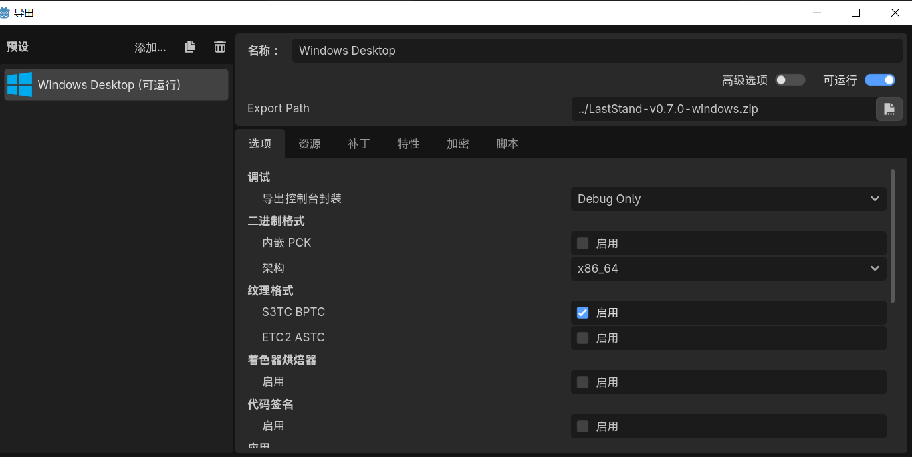

**发布前检查清单**（照着走，这几项每次都容易漏）：

```text
□ 版本号已同步全部 5 处显示串 + export 元数据：
    scenes/settings_menu.tscn
    scenes/ui_common/atmosphere_background.tscn
    scripts/ui/atmosphere_background.gd
    README.md 徽章
    README.md 开发状态
    export_presets.cfg 的 export_path
□ 调试残留已清：临时 victory_wave、强制刷怪类型、初始装备白给、可视化 mesh
□ CREDITS.md 已更新：新增资产的作者与授权（CC-BY 必须署名）
□ 本地打包实跑一遍：不是编辑器 F5，是解压 zip 双击 exe
□ 发布文案三份已写：GitHub Release / itch.io devlog / B站动态
□ docs/release_notes/vX.Y.Z.md 已存档文案
```

**三平台文案模板**（同一批内容，三种语气）：

```text
【GitHub Release】—— 面向开发者，讲清楚改了什么、为什么改
  这一版收拾了【主题】。
  - **【改动名】**：【问题现象】。这版【做法】，【效果】。
  - ...
  下一版按玩家反馈继续【方向】。

【itch.io devlog】—— 面向玩家，口语、可以自嘲
  vX.Y.Z 出了，主要收拾【主题】，顺手修了一堆实测手感问题。
  【用玩家能听懂的话复述问题和解法，可以承认调过头又回调】
  反馈走 itch 评论或 GitHub Issue。

【B站动态】—— 纯列表，一行一条，末尾挂 tag
  vX.Y.Z 出了。
  - 【改动】：【一句话】
  - ...
  #独立游戏 #Godot #FPS
```

打包产物传 GitHub Release，文案贴进去：

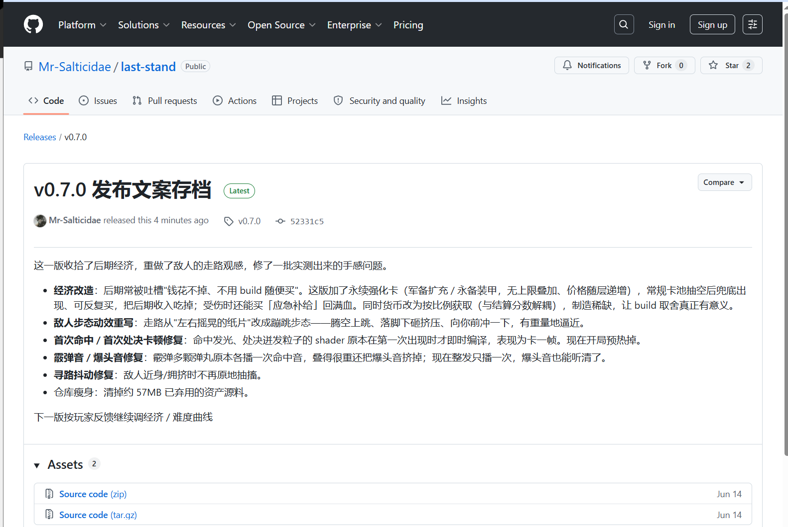

同一批内容再发一份到 itch.io，这边面向玩家、带评论区：

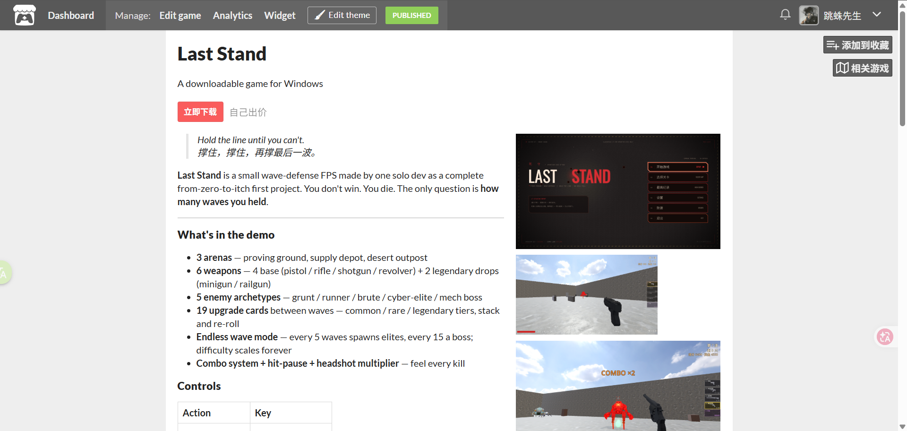

三份文案存进 `docs/release_notes/`，下次发版直接照着改。

---

## 四、总结

这套流程适合**一个人做、以周为单位迭代、靠玩家反馈驱动**的小体量游戏。核心是三条：

1. **核心循环用信号解耦**，让加内容不需要动骨架
2. **美术走能工业化的路线**（本项目是 2D 精灵），单个内容的边际成本必须低
3. **小步发版 + 反馈闭环**，每版一个主题，发完先听再定下一版

注：不要在核心循环还没手感之前堆内容量。本项目 v0.1 只有"能走能打能死"，但那个手感是对的，后面 6 个版本才堆得上去。

### 错误示范

以下都是本项目真实踩过的坑，git history 里有据可查。

**① 碰撞体靠猜，改了 5 版**

runner 的 hitbox 从 v1 改到 v5 才对，中间还专门写了运行时可视化才看清问题，最后靠手动在编辑器里拖到位。

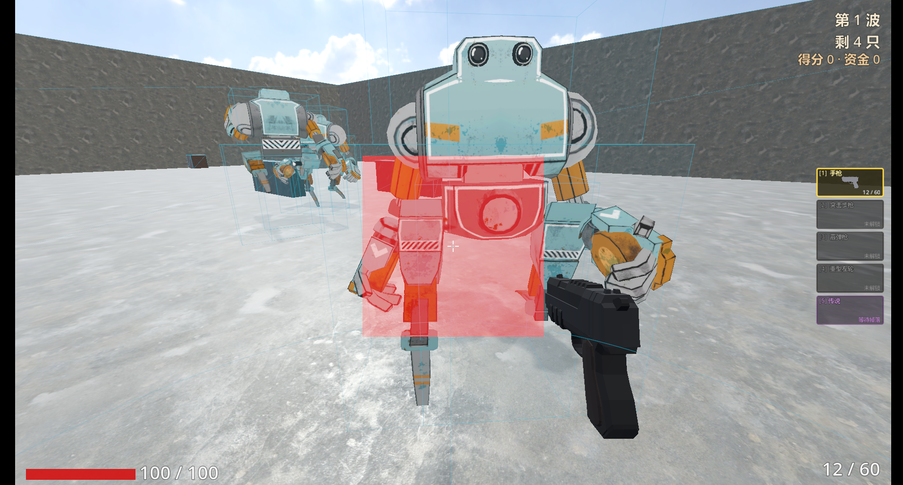

上图就是当时那套可视化：红色是头部判定，蓝色是躯干与腿部分段。**做出这张图之前，前四版全靠盯着模型猜数值**——图一出来，问题一眼就看见了。（画面里还是 v0.5 之前的 3D 机甲敌人，后来整体换成了 2D 精灵。）

> 教训：**异形模型的碰撞体，第一步就该做可视化**（红/蓝半透明 mesh 叠在模型上），不要凭模型外观猜数值。写可视化的 20 分钟能省下 5 轮返工。

**② 调试残留漏删，带着上线**

为了调 hitbox，临时把"第一波全部换成 runner"、"训练场 victory_wave 改成 2"、"给初始装备栏白送电磁炮"。其中 `victory_wave=2` 一直到下一个版本才被发现删掉——玩家在训练场打两波就通关了。

> 教训：**每一处临时改动，提交信息里就打上 `debug` 标记**，发布前 `git log --grep=debug` 扫一遍。

**③ 版本号散落 5 处**

版本号同时出现在主菜单背景、设置菜单底部、README 徽章、README 开发状态、export 路径。每次发版都漏一两处，v0.2.1 专门补了一次"版本号检查清单"。

> 教训：**要么集中到一个常量，要么写进发布检查清单**。散落的字符串一定会漏。

**④ 资产不管理，攒到 57MB 废料**

各版本换掉的旧模型、试过不用的贴图、弃用的素材源料一直躺在仓库里，直到 v0.7 专门做了一次瘦身才清掉约 57MB。

> 教训：**换掉一个资产的当次提交就把旧的删掉**，不要"先留着说不定还用"。git 历史里本来就有。

**⑤ 让 AI 判断手感**

代码可以让 AI 写，**手感必须自己进游戏试**。本项目 v0.7 经济改造第一版调得太狠，变成"刮痧"，是自己打了几局才发现，回调后才发出去。

> 教训：**任何影响手感的数值，改完必须自己打一局**。看代码看不出手感。

### 思维导图

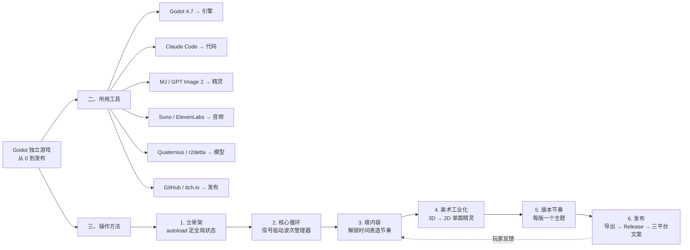

---

**相关文档**：[敌人精灵逐帧动画出图规范](enemy_sprite_animation.md) · [发布文案存档](release_notes/) · [资产授权](../CREDITS.md)
